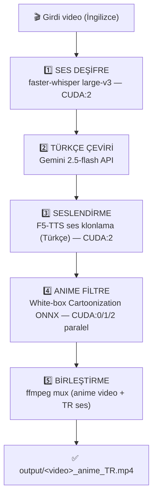

# Anime-Reels — Otomatik Türkçe Seslendirme + Anime Filtre Pipeline'ı


Yabancı (İngilizce) Reels/kısa videoları **toplu olarak** Türkçeye seslendirip
anime/çizgi film stiline çeviren, uçtan uca otomatik pipeline. Tamamen yerel
donanımda çalışır (bulut TTS/render servisi yok).



---

## 1. Donanım ve Ortam

- **Sunucu:** aiserver, Ubuntu, Ryzen 9 3900X, 60 GB RAM
- **GPU:** 3 × NVIDIA RTX 3060 (12 GB VRAM), CUDA 13 sürücü / CUDA 12 çalışma kütüphaneleri
- **GPU dağılımı:**
  - Ses (Faz 1): CUDA:2 (Whisper + F5-TTS)
  - Anime (Faz 2): CUDA:0 + CUDA:1 + CUDA:2 (videolar 3 karta dağıtılır, paralel)

---

## 2. Klasör Yapısı

```
~/anime-reels/
├── pipeline.py              # Ana orkestratör (5 adım)
├── f5_generate.py           # F5-TTS ses üretici (f5-env'de çalışır)
├── run_f5.sh                # F5'i izole ortamda çağıran wrapper (KRİTİK)
├── .env                     # GEMINI_API_KEY (gizli, chmod 600)
├── venv/                    # Ana ortam (onnxruntime, whisper, opencv)
├── f5-env/                  # İZOLE F5-TTS ortamı (kendi torch'u)
├── models/
│   └── whitebox_cartoon.onnx        # Anime filtre modeli
├── f5_models/
│   ├── f5_tts_turkish.safetensors   # Türkçe F5-TTS modeli (1.3 GB)
│   ├── vocab.txt                    # Türkçe kelime dağarcığı
│   └── ref_voice.wav                # Klonlanacak referans ses (karizmatik)
├── inputs/                  # İşlenecek videolar (1.mp4, 2.mp4, ...)
├── work/                    # Ara çıktılar (her video için cache'li)
│   └── <video>/
│       ├── 1_transcript.json        # STT çıktısı
│       ├── 2_translation.json       # Türkçe çeviri
│       ├── 3_turkish_audio.wav      # F5 klonlanmış ses
│       ├── 3_preview_turkish.mp4    # Ara önizleme (orijinal görüntü + TR ses)
│       ├── 4_anime_noaudio.mp4      # Anime filtreli video (sessiz)
│       └── f5_job.json              # F5'e gönderilen iş tanımı
└── output/
    └── <video>_anime_TR.mp4         # NİHAİ ÇIKTI
```

---

## 3. İki Ayrı Sanal Ortam (Neden?)

Bu projenin en önemli mimari kararı: **iki izole venv.**

- **`venv`** (ana): `onnxruntime-gpu==1.19.2`, `faster-whisper`, `opencv`,
  `edge-tts`, `google-genai`. Anime filtre + STT + çeviri burada.
- **`f5-env`** (izole): F5-TTS ve onun `torch` sürümü. Ana venv'in
  onnxruntime'ıyla çakışmaması için TAMAMEN ayrı.

Ana pipeline, F5 seslendirmeyi `f5-env`'de **subprocess** olarak çalıştırır.
İki ekosistem hiç karşılaşmaz → sürüm savaşı olmaz.

---

## 4. Kurulum (Sıfırdan)

### 4.1 Ana ortam (venv)
```bash
mkdir -p ~/anime-reels/{inputs,models,f5_models,output,work}
cd ~/anime-reels
python3.11 -m venv venv          # Python 3.11 ŞART (3.14 wheel yok)
source venv/bin/activate
python -m pip install --upgrade pip
python -m pip install onnxruntime-gpu==1.19.2 opencv-python-headless numpy tqdm \
    edge-tts google-genai pydub requests faster-whisper
python -m pip install nvidia-cublas-cu12 nvidia-cudnn-cu12 \
    nvidia-curand-cu12 nvidia-cufft-cu12 nvidia-cuda-runtime-cu12

# CUDA kütüphanelerinin yolunu venv aktivasyonuna göm (Whisper + ONNX için):
echo 'export LD_LIBRARY_PATH=$(python -c "import os,glob; base=os.path.join(os.environ[\"VIRTUAL_ENV\"],\"lib\",\"python3.11\",\"site-packages\",\"nvidia\"); print(\":\".join(glob.glob(os.path.join(base,\"*\",\"lib\"))))"):$LD_LIBRARY_PATH' >> venv/bin/activate
```

### 4.2 F5-TTS ortamı (f5-env)
```bash
cd ~/anime-reels
python3.11 -m venv f5-env
source f5-env/bin/activate
python -m pip install --upgrade pip
python -m pip install torch torchaudio f5-tts numpy soundfile
# CUDA yolu bu venv'de de gerekli:
echo 'export LD_LIBRARY_PATH=$(python -c "import os,glob; base=os.path.join(os.environ[\"VIRTUAL_ENV\"],\"lib\",\"python3.11\",\"site-packages\",\"nvidia\"); print(\":\".join(glob.glob(os.path.join(base,\"*\",\"lib\"))))"):$LD_LIBRARY_PATH' >> f5-env/bin/activate
deactivate
```

### 4.3 Modeller
```bash
# Anime filtre (White-box Cartoonization, PINTO model zoo):
#   models/whitebox_cartoon.onnx   (~4 MB, NCHW girdi [1,3,720,720])

# F5-TTS Türkçe modeli (marduk-ra, cc-by-nc-4.0):
cd ~/anime-reels/f5_models
wget -c "https://huggingface.co/marduk-ra/F5-TTS-Turkish/resolve/main/f5_tts_turkish_1000000.safetensors?download=true" -O f5_tts_turkish.safetensors
wget -c "https://huggingface.co/marduk-ra/F5-TTS-Turkish/resolve/main/vocab.txt?download=true" -O vocab.txt
# ref_voice.wav : klonlanacak 10-15 sn temiz referans ses (elle sağlanır)
```

### 4.4 F5 wrapper (KRİTİK — numpy sorununu çözen dosya)
```bash
cat > ~/anime-reels/run_f5.sh << 'EOF'
#!/usr/bin/env bash
unset PYTHONPATH PYTHONHOME VIRTUAL_ENV PYTHONNOUSERSITE
exec /home/atos/anime-reels/f5-env/bin/python /home/atos/anime-reels/f5_generate.py "$@"
EOF
chmod +x ~/anime-reels/run_f5.sh
```

### 4.5 API anahtarı
```bash
nano ~/anime-reels/.env          # içine: GEMINI_API_KEY=...
chmod 600 ~/anime-reels/.env
# Her oturumda yükle:
export $(grep -v '^#' ~/anime-reels/.env | xargs)
```

---

## 5. Kullanım

```bash
cd ~/anime-reels
source venv/bin/activate
export $(grep -v '^#' .env | xargs)

# Tüm klasörü işle (5 adım: transcribe→translate→voice→anime→mux):
python pipeline.py --input-dir inputs

# Tek video:
python pipeline.py --input inputs/1.mp4

# Belirli adımlar (test/yeniden üretim için):
python pipeline.py --input-dir inputs --steps transcribe,translate,voice
python pipeline.py --input-dir inputs --steps anime,mux

# Farklı GPU seti:
python pipeline.py --input-dir inputs --gpus 0,1,2

# Uzun batch için nohup (SSH kopsa da devam eder):
nohup python pipeline.py --input-dir inputs > batch_$(date +%H%M).log 2>&1 &
tail -f batch_*.log
```

**Cache mantığı:** Her adım çıktısını diske yazar ve "zaten var" kontrolü yapar.
Yarıda kesilirse tekrar çalıştırınca tamamlananları atlar, kaldığı yerden devam
eder. Bir adımı yeniden ürettirmek için ilgili dosyayı sil (ör. sesi yenilemek
için `rm work/*/3_turkish_audio.wav`).

---

## 6. Ayarlar (pipeline.py içindeki CONFIG)

| Ayar | Varsayılan | Açıklama |
|------|-----------|----------|
| `TTS_ENGINE` | `"f5"` | `"f5"` (klonlama) veya `"edge"` (hazır Türkçe ses) |
| `WHISPER_MODEL` | `"large-v3"` | STT modeli |
| `WHISPER_DEVICE_INDEX` | `2` | Whisper hangi GPU'da |
| `GEMINI_MODEL` | `"gemini-2.5-flash"` | Çeviri modeli |
| `ANIME_MODEL` | `whitebox_cartoon.onnx` | Filtre modeli |
| `ANIME_GPUS` | `[0,1,2]` | Anime render GPU'ları |
| `F5_REF_TEXT` | (sabit) | Referans sesin transkripti (hızlandırır) |
| `F5_NFE_STEP` | `32` | F5 kalite/hız (16 hızlı, 64 en iyi) |
| `TTS_MAX_SPEEDUP` | `1.35` | Segment süreye sığmazsa max hızlandırma |

---

## 7. Yol Boyunca Çözülen Sorunlar (Ders Notları)

Bu projede yaşanan ve tekrar yaşanmaması gereken tuzaklar:

1. **Python 3.14 → wheel yok.** torch/faster-whisper/f5-tts için 3.14
   paketleri yok. Her venv `python3.11` ile kurulmalı.

2. **`pip` sistem python'una kuruyor.** Venv aktifken bile `which pip`
   `/usr/bin/pip` gösterebiliyor. Çözüm: her zaman `python -m pip install`.
   `uv venv` pip sorunu çıkardı → standart `python3.11 -m venv` kullanıldı.

3. **faster-whisper `libcublas.so.12` bulamıyor.** ONNX/CTranslate2 CUDA
   kütüphanelerini göremiyor. Çözüm: `nvidia-*-cu12` pip paketleri +
   `LD_LIBRARY_PATH`'i venv aktivasyonuna gömmek.

4. **onnxruntime-gpu sürüm uyumu.** En yeni (1.27) CUDA 13 istiyor, sistemde
   CUDA 12 var → `onnxruntime-gpu==1.19.2` (CUDA 12 uyumlu) sabitlendi.
   Ayrıca `faster-whisper` CPU-only onnxruntime kuruyordu; GPU sürümü
   zorla yeniden kuruldu.

5. **Gemini model adı eskiyor.** `gemini-2.0-flash` artık 404.
   `gemini-2.5-flash` kullanılıyor. Kontrol: `curl .../v1beta/models?key=...`

6. **AnimateDiff/ComfyUI terk edildi.** Video-to-video yeniden üretim;
   titreme, yazı bozulması, senkron kayması, en-boy oranı bozulması ve
   ağır kurulum yüzünden bırakıldı. Yerine **filtre yaklaşımı** (ONNX)
   geldi — kareyi yeniden üretmez, stil uygular → titreme yok, oran korunur.

7. **AnimeGANv3 → White-box geçişi.** AnimeGAN'ın "anime dokusu" beğenilmedi;
   düz 2D toon için White-box Cartoonization seçildi. Kod her iki model
   formatını (NHWC dinamik / NCHW sabit 720) otomatik algılıyor. Dikey
   video 720×720'ye **letterbox** ile sığdırılıp geri açılıyor (kırpma yok).

8. **edge-tts → F5-TTS geçişi.** edge-tts'in Türkçe sesleri (Emel/Ahmet)
   nötr; karizmatik ton için F5-TTS ses klonlama + Türkçe model kullanıldı.

9. **F5-TTS `too many values to unpack`.** `f5.infer()` 3 değer döndürüyor;
   kod `result[0], result[1]` ile ilk ikisini alıyor.

10. **F5 subprocess'te `No module named numpy` (EN İNATÇI SORUN).**
    Ana venv aktifken `subprocess.run` ile çağrılan f5-env python'u kendi
    numpy'ını göremiyordu — ortam sızıntısı. Python tarafında `-E -s` +
    temiz `env` yetmedi. **Çözüm: `run_f5.sh` wrapper'ı** — bash `unset`
    ile PYTHONPATH/PYTHONHOME/VIRTUAL_ENV temizlenip `exec` ile doğrudan
    f5-env python çağrılıyor. Bash unset, Python env manipülasyonundan
    daha güvenilir çıktı. **Ders: izole venv'i subprocess'ten çağırırken
    wrapper + unset deseni kullan.**

---

## 8. Bilinen Sınırlar

- **Videodaki gömülü yazılar** çevrilemiyor (OCR + inpainting kapsam dışı
  bırakıldı). Anime filtre yazıları bozmaz (yeniden üretmediği için) ama
  İngilizce kalırlar.
- **Senkron** kısa/kesik segmentli videolarda zorlanabilir; `atempo` ile
  max 1.35x hızlandırma uygulanır.
- **Tek video hızı** GPU sayısıyla artmaz (bir video tek kartta işlenir);
  3 GPU sadece 3 videoyu paralel işleyerek toplam süreyi kısaltır.

---

## 9. Lisans / Hukuki Uyarı

- **F5-TTS Türkçe modeli** (marduk-ra): `cc-by-nc-4.0` — **ticari kullanım
  yasak.** Bu modelle üretilen sesi gelir getiren içerikte kullanmak lisansa
  aykırıdır.
- **Klonlanan referans ses:** Bir başkasının (seslendirme sanatçısı/YouTuber)
  sesini izinsiz klonlayıp yayınlamak, Türkiye'de kişilik hakları ihlali
  sayılabilir ve platform kurallarına aykırıdır. Yayın amaçlı kullanımda
  kullanım hakkına sahip olduğun bir ses (kendi sesin, lisanslı/telifsiz
  kayıt) tercih edilmeli.
- Kişisel/deneme kullanımı ile yayın/ticari kullanım hukuken farklıdır.
